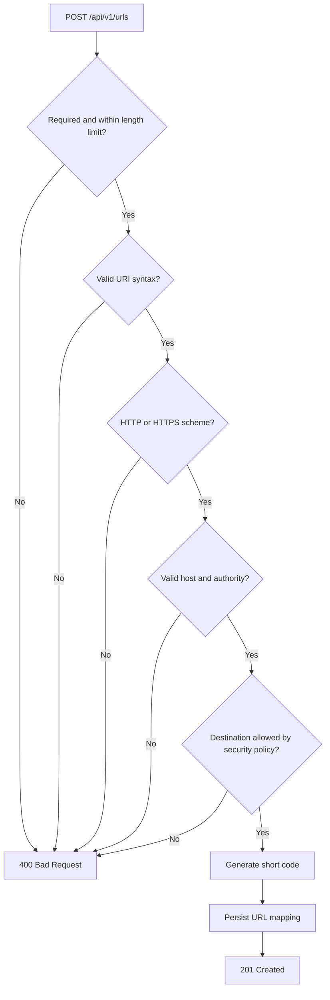

**Core Functional Requirements**

* URL Shortening   
  * The system shall generate a unique shortened URL from a valid original URL  
    * Using SHA-256 to hash the long URL and take the first 6 characters of the hash and use it as the shortened URL  
* URL Redirection   
  * The system shall redirect requests for shortened URLs to their corresponding original destinations.   
    * Index read from DB  
* URL Analytics   
  * The system shall track and retrieve analytics associated with shortened URLs.

**Supporting Function Requirements**

* Duplicate URL detection  
  * Return the existing shorted URL when an identical original URL is submitted again  
    * Database unique constraint  
* Collision Resolution  
  * Detect short-code collisions and regenerate a  unique identifier without overwriting existing mappings  
    * Database unique constraint  
    * If hashed long URL and first 6 characters of the hashcode is already used as a shortened URL AND the long URL associated with that shortened URL is NOT the same as the current long URL we are trying to shorten  
      * Re-hash  using long URL \+ \[Attempt \#\]  
        * For example [www.myLongURL.com1](http://www.myLongURL.com1)  
          * Long URL: [www.myLongURL.com](http://www.myLongURL.com1)  
          * Attempt \#: 1  
* URL Validation  
  * Reject malformed URLs, unsupported schemas, and missing or invalid hostnames  
  * Part of the URL creation service

* Redirect Loop Prevention  
  * Prevent users from shortening URLs that point directly to the shortener’s own configured domains  
* Error Handling  
  * Return appropriate HTTP  responses for invalid requests, unknown shortcodes, and application errors.

**Future Functional Requirements (Brownfield Enhancements)**  
Application architecture should be able to accommodate these without substantial refactoring. 

* User Management  
  * Support  registration, authentication, and URL ownership  
* URL management  
  * Allow users to deactivate, delete, or configure expiration dates for shorted URLs  
* Custom Aliases  
  * Allow users to select custom shorted URL identifiers  
* Malicious URL Detection  
  * Integrate URL reputation checks to identify and block malicious destinations  
* Abuse Reporting  
  * Allow users to report suspicious shorted URLs  
* Advanced Analytics  
  * Support geographic, referrer, and time-based analytics  
* URL suspension  
  * Allow administrators or automated security controls to disable malicious shortened URLs

   
**Non-Functional Requirements**

* Data Integrity  
  * Each short code must uniquely identify one original URL, preventing conflicting or overwritten mappings.   
* Performance  
  * The system should provide low-latency URL redirection through efficient short-code lookups.  
    * In memory hash  
    * Indexed lookup for DB  
* Scalability  
  * The architecture should accommodate future increases in URL creation and redirection traffic without significant changes to core business logic.  
    * Not claiming the H2 prototype can currently support millions of requests. Just establishing an architectural requirement that future scaling should be possible.   
* Maintainability and Extensibility  
  * Components should have clearly separated responsibilities, allowing future capabilities to be introduced without substantial refactoring. 

**Supporting Non-Functional Requirements**

* Reliability  
  * The system should gracefully handle invalid requests and application-level failures without corrupting existing URL mappings.   
* Security and Abuse Prevention  
  * The system should incorporate foundational security safeguards and support the future introduction of advanced abuse-prevention mechanisms.  
    * prototype will implement basic URL validation and direct redirect-loop prevention. More advanced controls remain future enhancements.   
* Portability  
  * The application should run locally with minimal configuration and allow migration between deployment environments.   
* Testability  
  * Core business logic should be independently testable through unit and integration tests 

**Future Non-Functional Requirements**

* High Availability   
  * Maintain service availability through redundant application instances and infrastructure failover.  
* Durability  
  * Ensure URL mappings and analytics survive application restarts and infrastructure failures through persistent storage.   
* Horizontal Scalability  
  * Support additional application instances and increasing read-heavy workloads through cloud infrastructure and distributed caching.   
* Advanced Security  
  * Introduce distributed rate limiting, malicious-link detection, abuse prevention, and infrastructure-level DDoS protection.   
* Observability  
  * Provide centralized logging, metrics, tracing, and monitoring of system health and performance.  
* Fault  Tolerance  
  * Maintain critical functionality during individual component failures through redundancy, recovery, and failure isolation.   
* Data Consistency in Distributed Environments   
  * Preserve URL mapping correctness across concurrent requests and multiple application instances. 

**Primary Capabilities**  
What operations the system supports

* Accept an original URL and generate a six-character shortened identifier   
* Resolve a short code and redirect to the corresponding original URL.   
* Track individual URL access events.   
* Retrieve analytics associated with a shortened URL.   
* Return an existing shortened URL when an identical original URL is submitted again. 

**Business Rules and Completion Conditions**  
These define what must happen internally for an operation to be considered successful

* Short codes are generated using SHA-256, initially extracting six hexadecimal characters.   
* Each short code must uniquely identify one original URL.   
* If a generated short code is already assigned to a different URL, increment the attempt counter and regenerate the hash.   
* Identical original URLs should resolve to the same existing mapping.   
  * Unique key in database   
    * The 6 hexadecimal characters from the short code used as unique key  
* A URL mapping must be successfully persisted before returning a newly generated shortened URL.   
* A successful redirect must resolve the original URL and record a corresponding click event.   
* URL analytics must be derived from the access events associated with the requested URL mapping. 

**Error Handling and Validation**  
How should the system behave when something goes wrong?  
**Scenarios**

* Malformed original URL   
  * Reject with HTTP 400   
* Unsupported scheme (e.g., `javascript:`)   
  * Reject with HTTP 400   
* Missing URL hostname   
  * Reject with HTTP 400   
* Submitted URL points to the shortener's own configured domain   
  * Reject with HTTP 400   
* Requested short code doesn't exist   
  * Return HTTP 404   
* Generated short code collides   
  * Retry generation using the next attempt number   
* Concurrent requests attempt conflicting inserts   
  * Preserve uniqueness through database constraints and transactional conflict handling   
  * Retry and its fixed  
* Unexpected application error   
  * Return an appropriate error without corrupting existing mappings

**Scope Boundaries**

* In scope  
  * URL shortening and redirection logic.  
  * SHA-256-based short-code generation.  
  * Duplicate detection and collision resolution.  
  * URL validation and direct loop prevention.  
  * Click tracking and analytics retrieval.  
  * H2 in-memory persistence.  
  * Class and interface design supporting future enhancements.  
  * Unit and integration testing.  
* Out of Scope — Future Enhancements   
  * User registration, authentication, and ownership.  
  * URL expiration, deletion, and custom aliases.  
  * Advanced malicious-link detection.  
  * Distributed rate limiting and DDoS protection.  
  * Persistent PostgreSQL deployment.  
  * Redis caching.  
  * Distributed analytics/event processing.  
  * Multi-instance cloud deployment.

**Core entities:**

**UrlMapping**  
Represents the persisted relationship between an original URL and its shortened identifier. It owns the durable state needed for URL creation and redirection.

* Likely fields later:  
  * Id  
  * originalUrl  
  * shortCode  
  * createdAt  
* Potential future fields:  
  * ownerId  
  * Status  
  * expiresAt  
* Rules associated with it:  
  * A short code must uniquely identify one original URL.  
  * A duplicate original URL should reuse its existing mapping.  
  * A mapping must exist before it can be resolved or analyzed.

**ClickEvent**  
Represents one access to a shortened URL. It owns the durable state needed for analytics. 

* Likely fields:   
  * Id  
  * urlMappingId  
  * clickedAt  
* Potential future fields:   
  * Referrer  
  * userAgent  
  * Country  
  * ipHash  
* Its main rule is that a click event belongs to an existing URL mapping.   
  * This limits the future delete feature to be soft deletes only

* ### **User — future entity**

  * Represents an authenticated user who can own and manage shortened URLs.  
  * Potential fields  
    * id  
    * email  
    * createdAt  
  * This should not be required by the initial prototype. When added later, ownership on UrlMapping should be optional so existing anonymous URLs remain valid. 

**Entity Relationships:**

* One UrlMapping can contain zero or many ClickEvents.   
* Each ClickEvent belongs to exactly one UrlMapping.   
* A future User can own zero or many UrlMappings.   
* A UrlMapping may optionally belong to one User. 

**Orchestration:**

* UrlService orchestrates URL creation, duplicate detection, collision resolution, and URL resolution.   
* AnalyticsService orchestrates click recording and analytics retrieval.   
* UrlValidator, ShortCodeGenerator, and repositories support those workflows but do not own domain state.