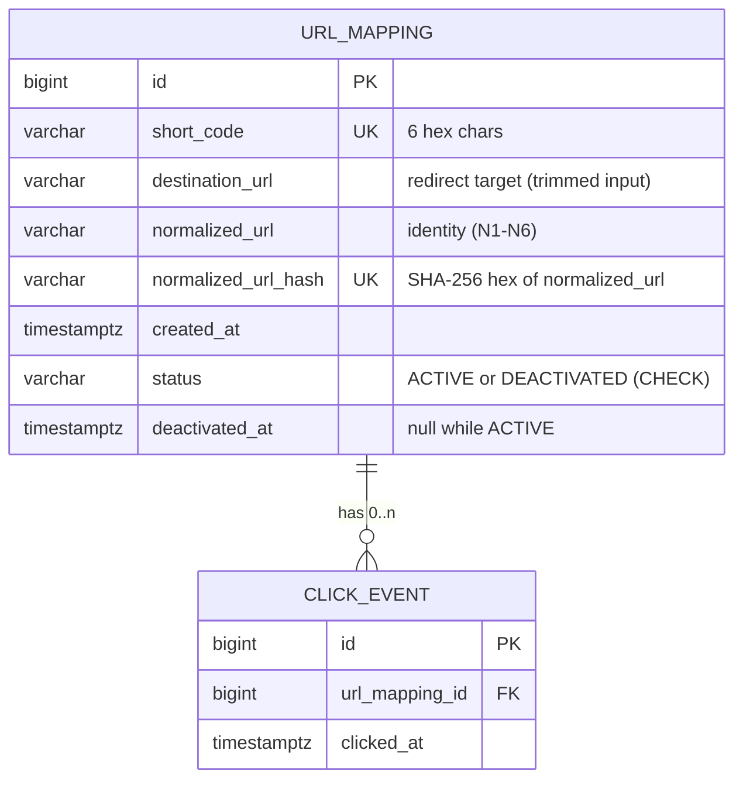
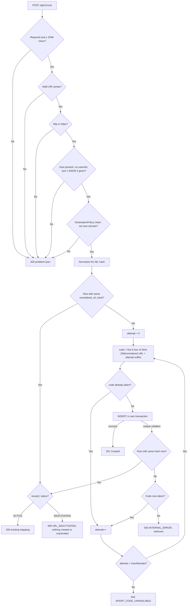
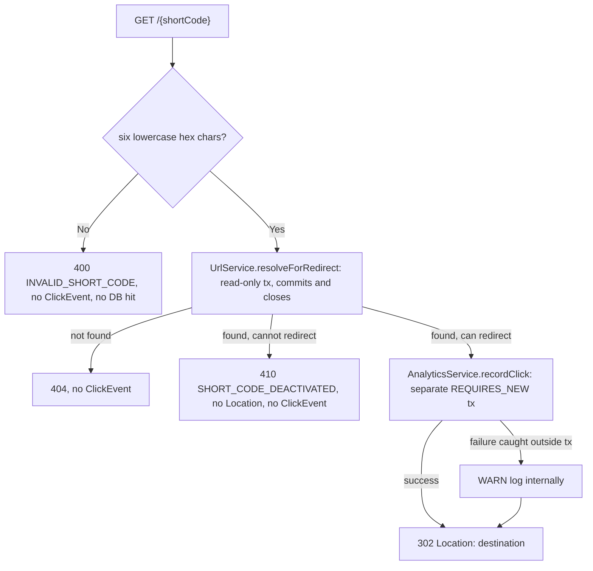
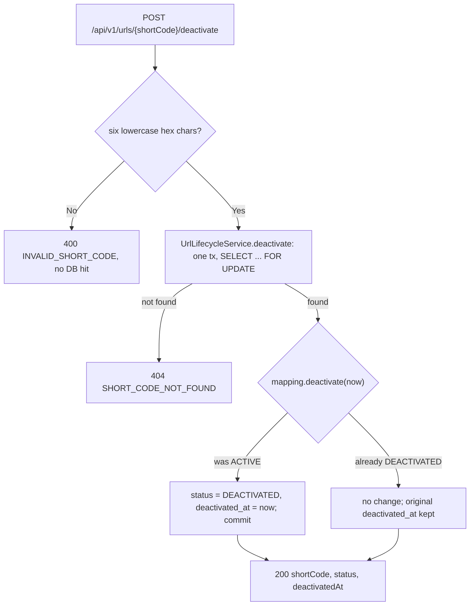

# Architecture

A **production-oriented prototype** of a URL shortener. Code structure, error handling, security controls, tests and the container follow production practice. The **H2 in-memory database and single-instance deployment are prototype infrastructure**, not production infrastructure (see [persistence.md](persistence.md)).

This document describes the **current** system.

| Source | What it holds |
|---|---|
| [`InitialDesignDoc.md`](../InitialDesignDoc.md) | My original pre-implementation design, kept unchanged |
| [`ai-workflow/brownfield-requirements.md`](ai-workflow/brownfield-requirements.md) | The later deactivation requirements |
| [ADRs](adr/) | Decisions not specified in those requirements, and deviations from them |

How the final system differs from the original design is summarized in [§13](#13-how-the-final-system-differs-from-the-original-design).

## 1. Requirements summary

**Functional (in scope)**

| ID | Requirement |
|---|---|
| F1 | Shorten a valid http(s) URL to a 6-hex-character code derived from SHA-256 |
| F2 | Redirect a short code to its destination |
| F3 | Record a click for every successful redirect; report analytics per short code |
| F4 | Equivalent URLs return the existing mapping (duplicate detection) |
| F5 | Resolve short-code collisions by re-hashing with an attempt number; never overwrite |
| F6 | Reject malformed URLs, unsupported schemes, missing hosts, ports outside 1–65535, and the shortener's own domains |
| F7 | Appropriate HTTP errors for invalid input, unknown codes and application failures |
| F8 | Deactivate a short URL: it stops redirecting (410) while its mapping and analytics are kept; idempotent ([ADR 0009](adr/0009-url-lifecycle-deactivation.md), brownfield) |

**Non-functional**: data integrity (one code ↔ one URL), low-latency indexed lookup, stateless services that can scale horizontally later, maintainability, reliability (no corrupted mappings), foundational security, portability (one command to run), testability.

**Out of scope** (future): users/auth/ownership, reactivation, expiration, suspension, deletion, custom aliases, malicious-link detection, rate limiting, PostgreSQL deployment, caching, async analytics, multi-instance deployment.

## 2. Business rules

- **BR-1** A short code is the first 6 lowercase hex characters of a SHA-256 hash of the **normalized** URL.
- **BR-2** Each short code identifies exactly one normalized URL, enforced by `UNIQUE(short_code)`.
- **BR-3** Equivalent normalized URLs resolve to the same mapping, enforced by `UNIQUE(normalized_url_hash)`. A resubmission returns the existing mapping, and its first-submitted destination.
- **BR-4** On a collision, retry with the next attempt number. An existing mapping is never overwritten.
- **BR-5** A mapping is persisted before a new short URL is returned.
- **BR-6** A successful redirect records a corresponding ClickEvent for analytics. Failed or unresolved redirect attempts are not included in click analytics.
- **BR-7** A *successful click* means the short code resolved to an existing UrlMapping and the application went ahead with returning HTTP 302. Whether the 302 reaches the client over the network, and whether the external destination loads, is outside what the application can observe, so it isn't measured. There is no destination pinging, health checking, proxying or monitoring.
- **BR-8** A failure to persist analytics never prevents an otherwise valid redirect.
- **BR-9** Analytics come from the ClickEvents of the requested mapping.
- **BR-10** A deactivated mapping keeps its code, destination and clicks. It never redirects (410) or records a click, its analytics stay readable, and it is never reused or reactivated by a shorten request (409).

### URL normalization (closed rule set, [ADR 0002](adr/0002-url-identity-and-normalization.md))

| Rule | Behavior | Example |
|---|---|---|
| N1 | Trim leading/trailing whitespace | `" https://a.com/ "` → `https://a.com/` |
| N2 | Lowercase scheme | `HTTPS://a.com/` → `https://a.com/` |
| N3 | Lowercase host | `https://A.COM/` → `https://a.com/` |
| N4 | Drop default port only (`:80` http, `:443` https) | `https://a.com:443/` → `https://a.com/`; `:8443` kept |
| N5 | Empty path becomes `/` | `https://a.com` → `https://a.com/` |
| N6 | Path, query, fragment kept byte-for-byte | `/A`, `/a/`, `?b=2&a=1` all preserved |

Nothing outside N1–N6 is normalized.

## 3. Domain model



- **UrlMapping** owns the durable code-to-destination association. Its identity is immutable after insert: there are no setters, and the identity columns are `updatable = false`. It also owns its lifecycle ([ADR 0009](adr/0009-url-lifecycle-deactivation.md)):
  - `UrlStatus` (`ACTIVE`, `DEACTIVATED`) is persisted by name. Each status declares whether it allows redirects.
  - `deactivate(Instant)` is the only transition and is idempotent; `canRedirect()` answers redirect eligibility.
  - Invariant: `deactivated_at` is null exactly when the status is `ACTIVE`, enforced by the entity and by `ck_url_mapping_lifecycle`.
- **ClickEvent** is one successful redirect. It's insert-only. It references its mapping by id plus a DB foreign key rather than a JPA association, which keeps the `analytics` feature independent of the `url` feature's entity. The FK means future deletion of mappings must be soft ([design doc](../InitialDesignDoc.md)).
- **Future User**: a nullable `owner_id` on `url_mapping`, added with a new Flyway migration, so anonymous mappings stay valid.

## 4. Package structure ([ADR 0001](adr/0001-package-by-feature.md))

Hybrid layout: **features at the top level, responsibilities inside each feature.**

```
com.schwab.urlshortener
├── url/                       shortening, resolution, lifecycle
│   ├── api/                   UrlController
│   │   └── dto/               CreateUrlRequest, UrlResponse, DeactivateUrlResponse
│   ├── service/               UrlService, UrlLifecycleService, UrlValidator, UrlNormalizer,
│   │                          DestinationPolicy, SelfReferencePolicy, ShortenResult,
│   │                          DeactivateResult, ResolvedUrl
│   ├── domain/                UrlMapping (entity), UrlStatus, ShortCode, InvalidUrlException,
│   │                          InvalidShortCodeException, ShortCodeNotFoundException,
│   │                          ShortCodeDeactivatedException, UrlDeactivatedException,
│   │                          ShortCodeExhaustedException
│   ├── repository/            UrlMappingRepository
│   └── generation/            ShortCodeGenerator, Sha256ShortCodeGenerator, Sha256
├── analytics/                 click recording + analytics
│   ├── api/                   AnalyticsController
│   │   └── dto/               AnalyticsResponse
│   ├── service/               AnalyticsService
│   ├── domain/                ClickEvent (entity), ClickStats
│   └── repository/            ClickEventRepository
├── redirect/                  the resolve → record-click workflow
│   ├── api/                   RedirectController
│   └── service/               RedirectService
├── ui/                        minimal demo UI (ADR 0010); static files in resources/static
│   ├── api/                   UiController (GET / page route)
│   └── web/                   UiSecurityHeadersFilter (CSP etc. for / and /assets/**)
└── common/
    ├── error/                 GlobalExceptionHandler
    ├── config/                ShortenerProperties, OpenApiConfig, ClockConfig
    ├── filter/                CorrelationIdFilter
    └── logging/               LogSanitizer
```

**Between features**, the dependency direction is acyclic: `redirect → url, analytics`, `analytics → url`, and everything may use `common`. `ui` depends on no other feature: it serves static files and talks to the API only over HTTP from the browser.

**Inside a feature**, dependencies point inward:
- `api → service → repository, generation, domain`
- `domain` depends on nothing in the feature
- Services never depend on `api.dto`. Controllers map service results to DTOs, for example `UrlResponse.from(...)` and `AnalyticsResponse.from(...)`.

Persisted entities live in `domain`, not `model`.

**Interfaces exist only at extension points named in the design doc:**
- `ShortCodeGenerator` (custom aliases)
- `DestinationPolicy` (malicious-URL reputation checks; add a bean and `UrlService` applies it automatically)

Services are concrete classes.

## 5. Workflows

### Shorten: `POST /api/v1/urls`



### Redirect: `GET /{shortCode}` ([ADR 0006](adr/0006-redirect-analytics-isolation.md))



### Analytics: `GET /api/v1/urls/{shortCode}/analytics`
The code is validated first (400 if malformed), then looked up with the **lifecycle-agnostic** `UrlService.resolve` (404 if unknown), so analytics stay available for deactivated URLs. Then one aggregate query runs, `COUNT(*)` and `MAX(clicked_at)` over that mapping's click events, served by the index `(url_mapping_id, clicked_at)`.

### Deactivate: `POST /api/v1/urls/{shortCode}/deactivate` ([ADR 0009](adr/0009-url-lifecycle-deactivation.md))



## 6. API

| Method | Path | Success | Errors |
|---|---|---|---|
| POST | `/api/v1/urls` body `{"url": "..."}` | 201 + `Location` (new), 200 (equivalent active URL exists) | 400, 409 (equivalent URL is deactivated), 503 |
| GET | `/{shortCode}` | 302 + `Location` | 400, 404, 410 (deactivated) |
| GET | `/api/v1/urls/{shortCode}/analytics` | 200 `{shortCode,totalClicks,lastClickedAt}`, also for deactivated URLs | 400, 404 |
| POST | `/api/v1/urls/{shortCode}/deactivate` (no body) | 200 `{shortCode,status,deactivatedAt}`, also when already deactivated | 400, 404 |
| GET | `/` (UI page, not in OpenAPI) and `/assets/**` | 200 static HTML, JS and CSS ([ADR 0010](adr/0010-minimal-static-ui.md)) | |

- **Versioning**: the management API is under `/api/v1`. The redirect path stays unversioned on purpose, because short URLs must never change.
- **Idempotency**: shortening is naturally idempotent for equivalent active URLs (same code, 200). Deactivation is idempotent: a repeat returns 200 with the original `deactivatedAt`.
- **Pagination**: not needed; no endpoint returns a collection.
- **OpenAPI**: Swagger UI is at `/swagger-ui.html` and the spec at `/v3/api-docs` (JSON) or `/v3/api-docs.yaml`. It's generated from the controller and DTO definitions and their annotations, which reduces the risk of the documentation drifting from the implemented API. Set `SPRINGDOC_ENABLED=false` to disable it.

## 7. Error handling

Errors handled by the application's error-handling layer (`GlobalExceptionHandler`, which also formats the Spring MVC exceptions it handles) are `application/problem+json` (RFC 9457), with a stable `code` and a `correlationId`. The fields are exactly `type, title, status, detail, instance, code, correlationId, timestamp`, plus `errors[]` for bean-validation failures. Requests that match no route (such as `/foo/bar`) may get the framework's own 404 handling and aren't guaranteed to follow this contract.

- `code` is a stable, machine-readable value, such as `UNSUPPORTED_SCHEME`, `INVALID_SHORT_CODE`, `SHORT_CODE_NOT_FOUND`, `SHORT_CODE_DEACTIVATED` (410), `URL_DEACTIVATED` (409), `SHORT_CODE_UNAVAILABLE` or `INTERNAL_ERROR`.
- `type` is `urn:problem-type:url-shortener:<code>`.
- `detail` is a fixed, client-safe message.
- Unexpected exceptions return a generic 500. Full details are logged server-side with the correlation id.
- Spring's default error attributes (stacktrace, exception, message) are disabled in `application.yml`.

## 8. Concurrency analysis

All Spring beans are stateless singletons. Their fields are final and hold immutable configuration or thread-safe collaborators. `MessageDigest`, which isn't thread-safe, is created per call. The correlation id lives in the thread-local MDC and is cleared in `finally`.

| # | Concern | Shorten | Redirect / click | Deactivate |
|---|---|---|---|---|
| 1 | Shared mutable state | Only the database | Only the database (insert-only rows) | One mapping row's lifecycle columns |
| 2 | Race conditions | Two requests for the same URL, or two URLs landing on the same code, between read and insert | None: each click is an independent insert | Two deactivations of one row (lost update); deactivation vs an in-flight redirect or shorten |
| 3 | Atomicity | A single-row INSERT guarded by two UNIQUE constraints | Single-row INSERT | Locked read, then one UPDATE of both columns in one transaction; CHECK enforces the pair |
| 4 | Visibility | Committed data only; each attempt commits before returning | Resolve commits before recording | Redirects and shortens started after the commit see DEACTIVATED (read committed, no cache) |
| 5 | Ordering | Not required; first committed insert wins | Not required | First committed deactivation wins; an in-flight redirect or shorten may finish on ACTIVE (documented) |
| 6 | Duplicate processing | Losing racer catches the violation and re-reads by hash: it returns the winner (or 409 if deactivated), retries if the code is now taken, and otherwise rethrows | Each redirect is a click by definition | Repeats return the stored state |
| 7 | Idempotency | Equivalent active URL → same mapping, always | n/a (clicks are events) | Yes: 200 with the original `deactivatedAt` |
| 8 | Deadlock risk | Low: creation relies on database uniqueness, not application locks; single-row inserts | Low: plain reads and single-row inserts | Low: one row lock per transaction, no other application locks |
| 9 | Partial failure | Failed insert leaves nothing behind; mapping never overwritten | Click failure is caught and logged; redirect still 302 | Transaction rolls back; the row stays ACTIVE |
| 10 | Multi-instance | Designed for shared-database coordination through the unique constraints; concurrency tested in-process on H2. Multi-instance deployment not exercised | Designed for it: no in-memory counters; clicks are database inserts. Not exercised multi-instance | Designed for it: persisted lifecycle state plus a database row lock. Not exercised multi-instance |

Broader production database behaviour (PostgreSQL, multiple instances, load) hasn't been exhaustively exercised.

**Decision:** no `synchronized`, no JVM locks, and no concurrent maps anywhere. The database is the concurrency authority ([ADR 0004](adr/0004-database-as-concurrency-authority.md)). The only database lock is the one-row `PESSIMISTIC_WRITE` taken by deactivation ([ADR 0009](adr/0009-url-lifecycle-deactivation.md)); other reads don't request it. Tests: `ShortenConcurrencyTest` (32 racing duplicates → 1 row), `CollisionIntegrationTest` (8 racing colliding URLs → 8 distinct codes), `AnalyticsIntegrationTest` (100 concurrent redirects → 100 clicks), `DeactivationConcurrencyTest` (16 racing deactivations → one `deactivatedAt`).

## 9. Security model and threat considerations

**Trust boundary:** all HTTP input is untrusted. There's no authentication in this prototype (out of scope). The service stores and redirects to URLs but **never fetches them**, so there's no server-side request forgery (SSRF) surface.

| Threat | Mitigation |
|---|---|
| `javascript:`, `data:`, `file:` URLs used for XSS or local access through a redirect | Scheme allow-list: http/https only |
| Redirect loops or chaining via the shortener's own domain | `SelfReferencePolicy`: own hosts (default `localhost`, `127.0.0.1`, `[::1]`) plus the base-URL host. Configured and incoming hosts pass through one local canonicalization: case-insensitive, trailing dot ignored, IPv6 literals in one textual form. There is no DNS resolution |
| Credential-bearing URLs (`user:pass@host`) and phishing-style authority confusion | userinfo rejected |
| SQL injection | Spring Data derived queries and JPQL with bound parameters only; no string-built SQL |
| Oversized input / memory DoS | 2048-character URL cap (the `destination_url` column size; `normalized_url` is 2049 because N5 can add `/`); no unbounded in-memory structures (no cache) |
| Enumeration of codes | Codes are hashes, not sequential. With 16⁶ ≈ 16.7M codes, enumeration is possible; rate limiting is future work |
| Information leakage in errors | Fixed messages; no stack traces, exception text, SQL or class names (tested in `ErrorResponseSecurityTest`) |
| Log injection / sensitive data in logs | Full URLs are never logged (query strings may hold tokens); only short codes. Untrusted values pass through `LogSanitizer`. Correlation ids must match `[A-Za-z0-9._-]{1,64}`, otherwise a new one is generated |
| Open-redirect abuse / malicious destinations | Inherent to a shortener. `DestinationPolicy` is the extension point for reputation checks (future) |
| Unauthorized deactivation | **Not mitigated in the prototype:** with no users, ownership or auth, anyone who knows a code can deactivate it. The prototype demonstrates URL lifecycle behaviour, but production exposure of the deactivation endpoint would require authenticated ownership or administrative authorization ([ADR 0009](adr/0009-url-lifecycle-deactivation.md)) |
| CSRF | Not applicable: no cookies or session auth. Revisit when user auth is added |
| XSS, clickjacking and MIME sniffing in the demo UI | `UiSecurityHeadersFilter`, scoped to the UI ([ADR 0010](adr/0010-minimal-static-ui.md)). `/` gets a strict `'self'`-only CSP (no `unsafe-inline`), `nosniff`, `Referrer-Policy: no-referrer` and `X-Frame-Options: DENY`; `/assets/**` gets `nosniff`. The API and Swagger are untouched. `app.js` renders API values only through `textContent`, links only to `/` + the encoded short code, and keeps no browser storage |
| Unsafe deserialization | Jackson maps into a record with one `String` field; no polymorphic typing |
| Secrets | None exist. H2 credentials are the non-secret in-memory defaults; config comes from environment variables |
| Container | Non-root user, JRE-only runtime image, one exposed port, app jar owned by root and read-only to the app user |
| Dependency vulnerabilities | Dependabot for Maven and Docker; versions managed by the Spring Boot BOM |
| H2 console | Disabled |

## 10. Logging and observability

- **ERROR**: unhandled exceptions (with stack trace) and short-code exhaustion.
- **WARN**: click-recording failures.
- **INFO**: mapping created, mapping deactivated (short code only).
- **DEBUG**: collisions, rejected input reasons, repeated (idempotent) deactivations.
- Request-scoped logs carry `[correlationId]` through `CorrelationIdFilter`, the MDC and `logging.pattern.correlation`; startup and other non-request entries may have none. The same id is returned in `X-Correlation-Id` and in problem bodies.
- Metrics, tracing and centralized logging are future work (actuator not included).

## 11. Testing strategy

| Layer | What | Where |
|---|---|---|
| Acceptance (Cucumber) | Consumer-visible behavior: shorten, validate, redirect, analytics, deactivation, failure isolation | `src/test/resources/features`, `bdd/` |
| Integration | Real app on a random port, real Flyway/H2 schema, HTTP black-box; UI page, assets and their headers | `*IntegrationTest` (including `UiIntegrationTest`), `SchemaMigrationTest`, `ErrorResponseSecurityTest` |
| Migration | Upgrading a V2-era database with data to the latest schema | `V3MigrationTest` |
| Concurrency | Racing duplicates, racing collisions, parallel clicks, racing deactivations | `ShortenConcurrencyTest`, `CollisionIntegrationTest`, `AnalyticsIntegrationTest`, `DeactivationConcurrencyTest` |
| Unit | Normalization rules, hash vectors, validation table, lifecycle invariants, service branches with Mockito | `*Test` under `url/domain`, `url/service`, `url/generation`, `analytics/service` |

Run everything with `./mvnw verify`.

## 12. Assumptions

1. URL identity is defined only by N1–N6. `https://a.com/x` and `https://a.com/x/` are different URLs. How the ambiguous "identical URL" requirement was interpreted is in [ambiguous-requirement-url-identity.md](ai-workflow/ambiguous-requirement-url-identity.md).
2. For equivalent URLs, the first-submitted form is the redirect target.
3. The retry hash input is `normalizedUrl + " #" + n`, not the design doc's `url + n`. See [ADR 0003](adr/0003-short-code-hashing-and-retry-input.md).
4. Duplicate submissions return **200** with the existing mapping, and new ones return **201**.
5. A 302 (not 301) is used so that every visit reaches the service and can be counted.
6. Malformed short codes (anything not matching `^[0-9a-f]{6}$`) return **400** `INVALID_SHORT_CODE` from the controller, before any lookup. Well-formed codes with no mapping return **404** `SHORT_CODE_NOT_FOUND`. Paths that don't match a route (`/foo/bar`) remain ordinary 404s. `/` serves the demo UI ([ADR 0010](adr/0010-minimal-static-ui.md)).
7. The design doc's "in-memory hash" performance note is not implemented as a cache. See [ADR 0007](adr/0007-no-cache-in-prototype.md).
8. `maxAttempts = 10`. Exhausting it means the code space is saturated, and the service returns 503 rather than overwriting anything.
9. Deactivation ([ADR 0009](adr/0009-url-lifecycle-deactivation.md)):
   - The endpoint takes no request body and lives in `UrlController`, beside shortening, because it operates on the same `/api/v1/urls` resource.
   - A deactivated code returns **410**, not 404, because the mapping still exists.
   - Shortening an equivalent URL returns **409** and never reactivates; reactivation is a future, explicit operation. The deactivate endpoint itself never returns 409.
   - Analytics responses don't expose the lifecycle status.

## 13. How the final system differs from the original design
[`InitialDesignDoc.md`](../InitialDesignDoc.md) is kept as written. The table records where implementation, review or later requirements moved away from it, and why.

| Original design | Final system | Why / where |
|---|---|---|
| "Identical" URLs share a mapping (not defined) | Conservative normalization N1–N6. `destination_url`, `normalized_url` and `normalized_url_hash` are stored separately, with `UNIQUE` on both the code and the hash | Ambiguity resolved explicitly ([ADR 0002](adr/0002-url-identity-and-normalization.md), [write-up](ai-workflow/ambiguous-requirement-url-identity.md)) |
| Retry hash input `longUrl + attempt` | `normalizedUrl + " #" + n` | The original input could collide with a real URL ([ADR 0003](adr/0003-short-code-hashing-and-retry-input.md)) |
| "In memory hash" for lookup performance | No cache; an indexed lookup only | No measured need; invalidation and memory risk ([ADR 0007](adr/0007-no-cache-in-prototype.md)) |
| A successful redirect must record a click | A click is recorded best-effort in its own transaction; a failure never breaks the 302 | Availability of redirects ([ADR 0006](adr/0006-redirect-analytics-isolation.md)) |
| Redirect status unspecified | 302, not 301 | Every visit must reach the service ([ADR 0008](adr/0008-302-redirects.md)) |
| Schema strategy unspecified | Flyway `V1`–`V3`; Hibernate validates only | One versioned schema source ([ADR 0005](adr/0005-flyway-schema-management-and-postgres-portability.md)) |
| Unknown short code → 404 | Unknown → 404; **malformed → 400 `INVALID_SHORT_CODE`** before any lookup | A change I made after manual testing |
| Concurrent conflicting inserts: "retry" | Each violation is classified as a duplicate (reuse), a code race (retry) or unexpected (rethrown → 500) | Manual review finding ([ADR 0004](adr/0004-database-as-concurrency-authority.md)) |
| Validation: malformed URL, scheme, host, own domain | Also rejects userinfo and ports outside 1–65535; own-domain checks canonicalize IPv6 loopback; the input limit is 2048 (`normalized_url` is 2049) | Design gaps and manual review findings |
| Deactivation, `Status` field: future enhancements | Implemented: `UrlStatus`, `deactivate`, 410 on redirect, 409 on re-shortening. Expiration, deletion and suspension remain future work | Brownfield scenario ([ADR 0009](adr/0009-url-lifecycle-deactivation.md)) |
| No UI | A minimal static demo UI at `/` | Reviewer usability ([ADR 0010](adr/0010-minimal-static-ui.md)) |
